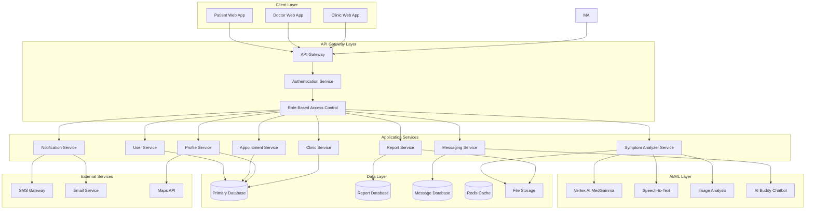

# Design Document: MediCheck

## Overview

MediCheck is an AI-powered healthcare platform that connects patients, doctors, and healthcare facilities through a secure, role-based system. The platform enables multi-modal symptom analysis (text, voice, image), generates AI-powered medical reports, facilitates secure communication between healthcare providers and patients, and manages professional associations between doctors and clinics.

The system is designed with three distinct user roles (Patient, Doctor, Clinic) with role-specific interfaces and capabilities. Core features include AI-driven symptom analysis using Google's Vertex AI MedGamma, secure healthcare data handling compliant with HIPAA/GDPR, real-time messaging, appointment management, and professional networking for healthcare providers.

## Architecture

### High-Level Architecture



### Architecture Principles

1. **Microservices Architecture**: Each major feature domain is implemented as an independent service with clear boundaries
2. **Role-Based Access Control**: All API endpoints enforce role-based permissions at the gateway level
3. **Event-Driven Communication**: Services communicate asynchronously through message queues for non-critical operations
4. **Data Encryption**: All sensitive data encrypted at rest (AES-256) and in transit (TLS 1.3)
5. **HIPAA/GDPR Compliance**: Audit logging, data retention policies, and access controls meet healthcare regulations
6. **Scalability**: Stateless services with horizontal scaling capabilities
7. **Fault Tolerance**: Circuit breakers, retry logic, and graceful degradation

### Technology Stack

- **Frontend**: React/Next.js for web, React Native for mobile
- **API Gateway**: AWS API Gateway
- **Backend Services**: AWS EC2
- **AI/ML**: Google Vertex AI MedGamma, Google Speech-to-Text, Google Vision AI
- **Databases**: DynamoDB
- **File Storage**: AWS S3
- **Message Queue**: RabbitMQ or AWS SQS
- **Authentication**: JWT tokens with refresh token rotation
- **Monitoring**: Prometheus, Grafana, ELK stack

## Components and Interfaces

### 1. Authentication Service

**Responsibilities:**
- User authentication and session management
- Role-based access control enforcement
- JWT token generation and validation
- Password encryption and credential management

**Key Interfaces:**

```typescript
interface AuthenticationService {
  // Authenticate user and return JWT tokens
  authenticate(credentials: UserCredentials): Promise<AuthResult>
  
  // Validate JWT token and extract user context
  validateToken(token: string): Promise<UserContext>
  
  // Refresh access token using refresh token
  refreshToken(refreshToken: string): Promise<TokenPair>
  
  // Revoke user session
  logout(userId: string, sessionId: string): Promise<void>
  
  // Check if user has required role/permission
  authorize(userId: string, requiredRole: UserRole, resource: string): Promise<boolean>
}

interface UserCredentials {
  email: string
  password: string
  role: UserRole
}

interface AuthResult {
  success: boolean
  accessToken?: string
  refreshToken?: string
  user?: UserProfile
  error?: string
}

interface UserContext {
  userId: string
  role: UserRole
  permissions: string[]
  sessionId: string
}

enum UserRole {
  PATIENT = 'PATIENT',
  DOCTOR = 'DOCTOR',
  CLINIC = 'CLINIC'
}
```

### 2. Symptom Analyzer Service

**Responsibilities:**
- Process multi-modal symptom inputs (text, voice, image)
- Interface with Vertex AI MedGamma for medical analysis
- Generate comprehensive medical reports
- Handle speech-to-text and image analysis

**Key Interfaces:**

```typescript
interface SymptomAnalyzerService {
  // Analyze symptoms from text input
  analyzeText(patientId: string, symptoms: string): Promise<AnalysisResult>
  
  // Analyze symptoms from voice input
  analyzeVoice(patientId: string, audioFile: File): Promise<AnalysisResult>
  
  // 